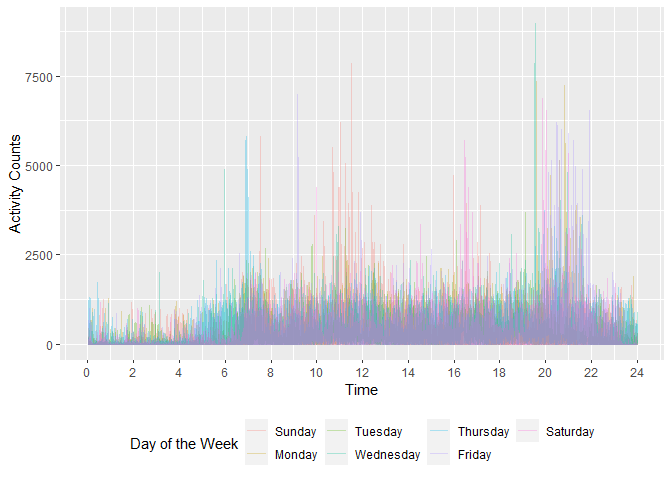

p8105_hw3_sc5154
================
2022-10-15

``` r
library(tidyverse)
```

    ## Warning: package 'tidyverse' was built under R version 4.1.3

    ## -- Attaching packages --------------------------------------- tidyverse 1.3.2 --
    ## v ggplot2 3.3.5     v purrr   0.3.4
    ## v tibble  3.1.6     v dplyr   1.0.7
    ## v tidyr   1.1.4     v stringr 1.4.0
    ## v readr   2.1.1     v forcats 0.5.1
    ## -- Conflicts ------------------------------------------ tidyverse_conflicts() --
    ## x dplyr::filter() masks stats::filter()
    ## x dplyr::lag()    masks stats::lag()

# Problem 2

## Question 1

> Load, tidy, and otherwise wrangle the data. Your final dataset should
> include all originally observed variables and values; have useful
> variable names; include a weekday vs weekend variable; and encode data
> with reasonable variable classes. Describe the resulting dataset
> (e.g. what variables exist, how many observations, etc).

``` r
accel_df = read_csv("data/accel_data.csv") %>%
  janitor::clean_names() %>%
  pivot_longer(
    activity_1:activity_1440,
    names_to = 'activity_index',
    names_prefix = 'activity_',
    values_to = 'activity_count'
  ) %>%
  mutate(
  day = factor(day, levels = c('Sunday', 'Monday', 'Tuesday', 'Wednesday', 'Thursday', 'Friday', 'Saturday')),
  is_weekday = ifelse((day == 'Saturday' | day == 'Sunday'), 0, 1),
  activity_index = as.numeric(activity_index)
  ) %>%
  arrange(week, day_id)
```

    ## Rows: 35 Columns: 1443
    ## -- Column specification --------------------------------------------------------
    ## Delimiter: ","
    ## chr    (1): day
    ## dbl (1442): week, day_id, activity.1, activity.2, activity.3, activity.4, ac...
    ## 
    ## i Use `spec()` to retrieve the full column specification for this data.
    ## i Specify the column types or set `show_col_types = FALSE` to quiet this message.

``` r
head(accel_df)
```

    ## # A tibble: 6 x 6
    ##    week day_id day    activity_index activity_count is_weekday
    ##   <dbl>  <dbl> <fct>           <dbl>          <dbl>      <dbl>
    ## 1     1      1 Friday              1           88.4          1
    ## 2     1      1 Friday              2           82.2          1
    ## 3     1      1 Friday              3           64.4          1
    ## 4     1      1 Friday              4           70.0          1
    ## 5     1      1 Friday              5           75.0          1
    ## 6     1      1 Friday              6           66.3          1

The final dataset contains 50400 rows (observations) and 6 columns. The
variables are week, day_id, day, activity_index, activity_count,
is_weekday. ‘is_weekday’ indicates weekday vs. weekend. ‘activity_index’
and ‘activity_count’ are obtained by transforming from the original
dataset for better clarity.

## Qustion 2

> Traditional analyses of accelerometer data focus on the total activity
> over the day. Using your tidied dataset, aggregate across minutes to
> create a total activity variable for each day, and create a table
> showing these totals. Are any trends apparent?

``` r
accel_df %>%
  group_by(week, day) %>%
  summarize(daily_activity_total = sum(activity_count)) %>%
  arrange(week, day) %>%
  pivot_wider(
    names_from = day,
    values_from = daily_activity_total
  ) %>%
  knitr::kable()
```

    ## `summarise()` has grouped output by 'week'. You can override using the `.groups`
    ## argument.

| week | Sunday |    Monday |  Tuesday | Wednesday | Thursday |   Friday | Saturday |
|-----:|-------:|----------:|---------:|----------:|---------:|---------:|---------:|
|    1 | 631105 |  78828.07 | 307094.2 |    340115 | 355923.6 | 480542.6 |   376254 |
|    2 | 422018 | 295431.00 | 423245.0 |    440962 | 474048.0 | 568839.0 |   607175 |
|    3 | 467052 | 685910.00 | 381507.0 |    468869 | 371230.0 | 467420.0 |   382928 |
|    4 | 260617 | 409450.00 | 319568.0 |    434460 | 340291.0 | 154049.0 |     1440 |
|    5 | 138421 | 389080.00 | 367824.0 |    445366 | 549658.0 | 620860.0 |     1440 |

Note that the daily total activity counts on Saturday for week 4 and 5
are both 1440, which is equal to the number of minutes in a day. This
seems abnormal and should be considered outliers. Apart from that, no
obvious trend or pattern is observed from the table.

## Question 3

> Accelerometer data allows the inspection activity over the course of
> the day. Make a single-panel plot that shows the 24-hour activity time
> courses for each day and use color to indicate day of the week.
> Describe in words any patterns or conclusions you can make based on
> this graph.

``` r
accel_df %>%
  mutate(
    daily_time = floor((activity_index)/60) +
      (1/60) * (activity_index) %% 60
    ) %>%
  ggplot(aes(x = daily_time, y = activity_count, color = day)) +
    geom_line(alpha = 0.3) + 
    theme(legend.position = 'bottom') + 
    scale_x_continuous(limits = c(0,24), breaks = seq(0, 24, 2)) +
    labs(x = 'Time', 
         y = 'Activity Counts', 
         color = 'Day of the Week')
```

<!-- -->

Activity counts are minimum between 12 am and 4 am and are maximum
between 8 pm and 10 pm. They is also a local maximum between 10 am and
12 pm.

# Problem 3

## Question 1

> Do some data cleaning. Create separate variables for year, month, and
> day. Ensure observations for temperature, precipitation, and snowfall
> are given in reasonable units. For snowfall, what are the most
> commonly observed values? Why?

## Question 2

> Make a two-panel plot showing the average max temperature in January
> and in July in each station across years. Is there any observable /
> interpretable structure? Any outliers?

## Question 3

> Make a two-panel plot showing (i) tmax vs tmin for the full dataset
> (note that a scatterplot may not be the best option); and (ii) make a
> plot showing the distribution of snowfall values greater than 0 and
> less than 100 separately by year.
